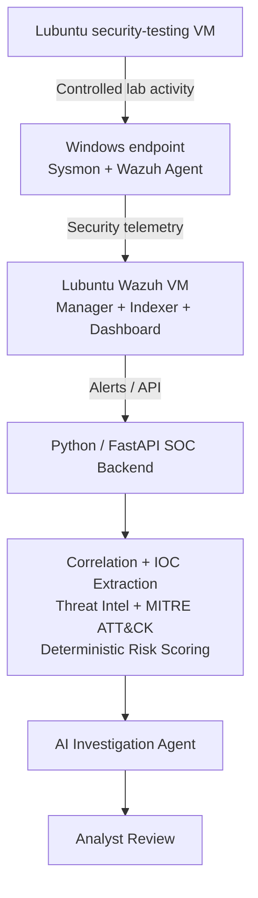

# AI-Augmented Security Operations Lab

A hands-on cybersecurity portfolio project that combines endpoint telemetry, Wazuh SIEM, detection engineering, event correlation, threat-intelligence enrichment, MITRE ATT&CK mapping, and AI-assisted incident investigation.

> **Status:** 🚧 In development

## Project Goal

Build a small but realistic Security Operations Center (SOC) lab where security events from monitored endpoints are collected by Wazuh, enriched and correlated by a custom backend, and analyzed by an AI investigation agent while keeping final decisions under analyst review.

## Planned Architecture



A Windows Server / Active Directory VM will be added later for AD-specific detection scenarios.

## Initial Lab Environment

| System | Role | Planned Lab IP |
|---|---|---|
| Windows host | Monitored endpoint | `192.168.56.1`* |
| Lubuntu VM #1 | Wazuh SIEM | `192.168.56.10` |
| Lubuntu VM #2 | Security-testing workstation | `192.168.56.20` |
| Windows Server VM | Active Directory (later phase) | `192.168.56.30` |

\*The host-only adapter address will be verified during setup rather than assumed.

## Roadmap

- [ ] Phase 1 — Build isolated virtual lab network
- [ ] Phase 2 — Deploy Wazuh all-in-one SIEM
- [ ] Phase 3 — Onboard Windows endpoint and collect Sysmon telemetry
- [ ] Phase 4 — Create controlled detection scenarios
- [ ] Phase 5 — Add custom detection and event-correlation logic
- [ ] Phase 6 — Build Python/FastAPI SOC backend
- [ ] Phase 7 — Add IOC extraction and threat-intelligence enrichment
- [ ] Phase 8 — Add MITRE ATT&CK mapping and deterministic risk scoring
- [ ] Phase 9 — Add tool-using AI investigation agent
- [ ] Phase 10 — Generate incident reports and analyst-review workflow
- [ ] Phase 11 — Evaluate detection and AI-analysis quality

## Documentation

Detailed build notes will be kept in [`docs/`](docs/):

1. Architecture
2. Lab setup and networking
3. Wazuh deployment
4. Windows/Sysmon telemetry
5. Detection scenarios
6. AI investigation pipeline
7. Evaluation methodology
8. Troubleshooting notes

The repository will be updated as each stage is implemented so that the project remains reproducible rather than becoming a final screenshot-only demo.

## Security and Ethics

All attack simulations in this repository are intended **only for systems owned by me inside an isolated lab environment**. The project is designed for defensive-security learning, detection engineering, and incident-response practice.

## Planned Technology Stack

- **SIEM:** Wazuh
- **Endpoint telemetry:** Sysmon, Windows Event Logs, Linux logs/audit data
- **Lab systems:** Windows, Lubuntu, Windows Server / Active Directory
- **Backend:** Python, FastAPI
- **Data layer:** PostgreSQL (later phase)
- **Threat intelligence:** provider APIs where appropriate
- **Framework:** MITRE ATT&CK
- **AI:** provider-agnostic LLM integration with structured outputs and tool calling

## Portfolio Focus

The project is intended to demonstrate practical ability in:

- SOC operations and alert triage
- SIEM deployment and administration
- Windows security telemetry
- Detection engineering
- Event correlation
- Threat-intelligence enrichment
- MITRE ATT&CK mapping
- Python security automation
- API integration
- AI-assisted security analysis
- Human-in-the-loop incident response
- Technical documentation

## Repository Structure

```text
ai-augmented-soc-lab/
├── README.md
├── .gitignore
├── .env.example
├── docs/
├── diagrams/
├── screenshots/
├── configs/
├── detection-rules/
├── attack-simulations/
├── backend/
├── reports/
└── scripts/
```

## Disclaimer

This project is for educational and authorized defensive-security research only.
