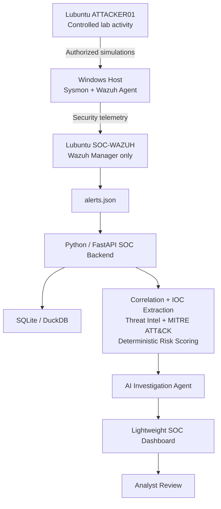

# AI-Augmented Security Operations Lab

A resource-optimized cybersecurity portfolio project combining Windows telemetry, Wazuh detection, event correlation, threat-intelligence enrichment, MITRE ATT&CK mapping, deterministic risk scoring, and AI-assisted incident investigation.

> **Status:** 🚧 Final lightweight architecture being implemented

## Project Goal

Build a realistic SOC workflow on constrained hardware. Windows telemetry is collected with Sysmon and the Wazuh agent, analyzed by a lightweight Wazuh Manager, then consumed from Wazuh JSON alerts by a custom Python/FastAPI investigation platform.

The project intentionally avoids running the Wazuh Indexer/OpenSearch and Dashboard in the final lab. A full Wazuh all-in-one deployment was successfully built and validated first, then replaced after resource profiling showed that the indexing layer was unnecessarily heavy for a 16 GB RAM / ~50 GB free-disk laptop.

## Final Architecture

## Lab Environment

| System | Role | Lab IP | Target resources |
|---|---|---|---|
| Windows host | Monitored endpoint | `192.168.56.1` | Physical host |
| `SOC-WAZUH` | Wazuh Manager / detection engine | `192.168.56.10` | Lubuntu 24.04 LTS, ~3 GB RAM, 2 vCPU, 15 GB dynamic disk |
| `ATTACKER01` | Controlled security-testing workstation | `192.168.56.20` | 1.5–2 GB RAM, 2 vCPU, 8–10 GB dynamic disk |
| `DC01` (optional later) | Active Directory scenarios | `192.168.56.30` | Run only when needed |

## Architecture History

### Prototype — full Wazuh SIEM ✅

The first prototype successfully deployed and validated:

- Wazuh Manager 4.14.7
- Wazuh Indexer / OpenSearch
- Wazuh Dashboard
- Filebeat
- Browser access to the Wazuh Overview

That deployment remains documented as evidence of full-stack Wazuh experience.

### Final design — resource-optimized SOC

The final lab keeps the Wazuh detection engine but removes the resource-heavy indexing and visualization layer. Wazuh-generated JSON alerts become the input to the custom SOC backend.

## Roadmap

- [x] Phase 0 — Build and validate full Wazuh all-in-one prototype
- [x] Phase 1 — Build isolated VirtualBox lab network
- [ ] Phase 2 — Rebuild `SOC-WAZUH` as manager-only
- [ ] Phase 3 — Onboard Windows endpoint and collect Sysmon telemetry
- [ ] Phase 4 — Create controlled detection scenarios
- [ ] Phase 5 — Build alert ingestion and event-correlation pipeline
- [ ] Phase 6 — Build Python/FastAPI SOC backend and lightweight datastore
- [ ] Phase 7 — Add IOC extraction and threat-intelligence enrichment
- [ ] Phase 8 — Add MITRE ATT&CK mapping and deterministic risk scoring
- [ ] Phase 9 — Add tool-using AI investigation agent
- [ ] Phase 10 — Build lightweight analyst dashboard and incident reports
- [ ] Phase 11 — Evaluate detection and AI-analysis quality

## Planned Technology Stack

- **Detection / endpoint management:** Wazuh Manager + Wazuh Agent
- **Endpoint telemetry:** Sysmon, Windows Event Logs
- **Detection content:** Wazuh rules, custom rules, Sigma where useful
- **Backend:** Python, FastAPI
- **Data layer:** SQLite or DuckDB for the lab
- **Threat intelligence:** provider APIs where appropriate
- **Framework:** MITRE ATT&CK
- **AI:** provider-agnostic LLM integration with structured outputs and tool calling
- **Interface:** lightweight custom SOC dashboard

## Portfolio Focus

The project demonstrates:

- SOC operations and alert triage
- Wazuh deployment and administration
- Windows/Sysmon security telemetry
- Detection engineering
- Resource-aware security architecture
- Event correlation
- Threat-intelligence enrichment
- MITRE ATT&CK mapping
- Python security automation
- AI-assisted security analysis
- Human-in-the-loop incident response
- Technical troubleshooting and documentation

## Security and Ethics

All attack simulations are limited to systems owned by the project author inside the isolated lab environment. The project is for authorized defensive-security learning, detection engineering, and incident-response practice.

## Disclaimer

This project is for educational and authorized defensive-security research only.
