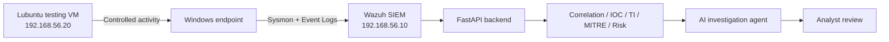

# Architecture

## Objective

Build a compact SOC lab that separates telemetry collection, detection, enrichment/correlation, AI-assisted investigation, and analyst review.

## Initial Topology

## Design Principles

- Keep the attacker/testing environment separate from monitoring infrastructure.
- Use deterministic logic for risk scoring where possible; use the LLM for analysis and explanation.
- Keep remediation human-approved.
- Keep the AI provider replaceable.
- Store no credentials or secrets in Git.

## Planned Extension

A Windows Server / Active Directory VM will be added later for identity and AD-specific scenarios.
