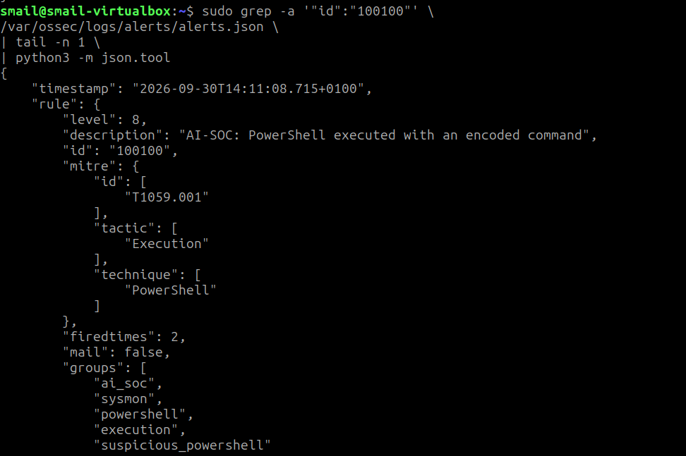

# Detection Scenarios

> Status: two custom Sysmon detections validated

Each scenario documents the objective, telemetry source, detection logic, ATT&CK mapping, validation result, limitations, and improvement ideas.

## Scenario 1 — Encoded PowerShell Execution

### Objective

Detect Windows PowerShell process creation when the command line uses `-enc` or `-EncodedCommand`.

### Source and target

- Source endpoint: `FALCON-PC`
- Telemetry source: Sysmon Event ID 1 — Process Create
- Collection: Wazuh Agent
- Detection engine: Wazuh Manager
- Custom rule ID: `100100`

### Detection logic

The rule is evaluated only for events already classified in the Wazuh `sysmon_event1` group.

It then requires both:

1. `win.eventdata.image` ends in `powershell.exe`
2. `win.eventdata.commandLine` contains `-enc` or `-EncodedCommand`

### MITRE ATT&CK

- `T1059.001` — PowerShell
- Tactic observed in the generated alert: Execution

### Controlled validation

A harmless PowerShell command was Base64-encoded and executed with `-EncodedCommand`.

Expected behavior:

```text
PowerShell process creation
  -> Sysmon Event ID 1
  -> Wazuh Agent
  -> Wazuh Manager
  -> custom rule 100100
  -> level 8 alert
```

### Result

The rule fired successfully.

Observed alert properties:

- rule ID: `100100`
- level: `8`
- description: `AI-SOC: PowerShell executed with an encoded command`
- agent: `FALCON-PC`
- Sysmon event ID: `1`
- process: `powershell.exe`
- integrity level: High
- MITRE technique: `T1059.001`
- group tags include `execution` and `suspicious_powershell`

### Evidence

Sanitized validation evidence:

```text
evidence/detections/01-encoded-powershell-detection.txt
```



Rule source:

```text
detection-rules/ai_soc_rules.xml
```

### False-positive considerations

Encoded PowerShell is suspicious but not inherently malicious. Legitimate administration, software deployment, management tooling, and automation can also use encoded commands.

The rule is intentionally treated as a triage signal rather than proof of compromise.

### Possible improvements

Future correlation can increase confidence by combining this signal with:

- unusual parent process
- outbound network activity
- suspicious child processes
- execution from user-writable paths
- repeated encoded PowerShell executions
- known-bad IOC enrichment
- high-risk user or host context

## Scenario 2 — PowerShell Spawns Windows Command Shell

### Objective

Detect a Sysmon Process Create event where `cmd.exe` is launched by `powershell.exe`.

### Detection logic

The rule is evaluated for `sysmon_event1` events and requires both:

1. `win.eventdata.image` ends in `cmd.exe`
2. `win.eventdata.parentImage` ends in `powershell.exe`

### MITRE ATT&CK

- `T1059.003` — Windows Command Shell
- Tactic: Execution

### Controlled validation

A harmless encoded PowerShell command launched:

```text
cmd.exe /c echo AI-SOC-CORRELATION-TEST
```

The test intentionally created a direct process relationship:

```text
powershell.exe
    -> cmd.exe
```

### Result

Rule `100101` fired successfully at level `6` on endpoint `FALCON-PC`.

The Sysmon event showed:

- Event ID `1` — Process Create
- Image: `cmd.exe`
- Parent image: `powershell.exe`
- Matching parent process ID / process relationship with the preceding encoded PowerShell execution

### Evidence

```text
evidence/detections/02-powershell-cmd-chain.txt
```

### False-positive considerations

PowerShell legitimately starts `cmd.exe` in some administrative and automation workflows. This rule is therefore a contextual signal rather than a high-confidence compromise indicator by itself.

Its value increases when correlated with the encoded-PowerShell alert from rule `100100`.

## Lab Finding — Sysmon Event ID 3 Live Rule Dispatch

### Objective

Validate a third signal for PowerShell network activity using Sysmon Event ID 3.

### What was verified

- Sysmon generated Event ID 3 on `FALCON-PC`.
- The Wazuh agent forwarded the event.
- Wazuh Manager received it.
- The event appeared in `archives.json` when raw archiving was temporarily enabled.
- The event decoded with the expected fields, including process image, source/destination IPs, and destination port.
- A self-contained custom rule for Sysmon Event ID 3 matched successfully in `wazuh-logtest` and reported that an alert would be generated.

### Live-processing result

The same rule did not generate a live alert in `alerts.json`, even after testing both:

- a standalone field-based rule, and
- a rule chained from the base Windows EventChannel rule with `if_sid 60000`.

Because collection, forwarding, decoding, and rule logic were all separately validated, this scenario is recorded as a Wazuh live-processing limitation rather than a failed telemetry configuration.

The lab therefore keeps rules `100100` and `100101` as the validated detection baseline and moves correlation into the custom Python backend instead of spending additional time on this SIEM-specific behavior.

### Evidence

```text
evidence/troubleshooting/01-sysmon-event3-live-rule-dispatch.txt
```

## Planned Scenarios

- Network reconnaissance / service discovery
- Repeated authentication failures
- New local user creation
- Privileged group modification
- Suspicious outbound connection
- Persistence-related activity
- Active Directory scenarios after `DC01` is added

## Scenario Quality Rule

A scenario is not considered complete just because an alert fired. The write-up should explain what was observed, what was missed, false-positive considerations, and how the detection could be improved.
