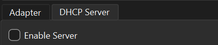

# Networking Evidence

This folder contains screenshots captured during the initial VirtualBox networking setup for the AI-Augmented SOC Lab.

## Evidence

### 1. Host-only network configuration

Verified from the screenshot:

- Adapter configured manually
- IPv4 address: `192.168.56.1`
- Network mask: `255.255.255.0`
- Planned lab subnet: `192.168.56.0/24`

### 2. VM NAT adapter

The first VM network adapter is configured as **NAT** to provide Internet access for package installation, updates, documentation, and API access.

### 3. VM host-only adapter

The second VM network adapter is configured as **Host-only Adapter** using `VirtualBox Host-Only Ethernet Adapter #2`. This interface will carry isolated SOC lab traffic.

### 4. Host-only DHCP server disabled

The **Enable Server** checkbox is unchecked on the **DHCP Server** tab, confirming that DHCP is disabled for the host-only network. Lab systems use static host-only IP addresses.

## Remaining validation

These screenshots confirm the planned adapter configuration, but the following still need separate verification before the networking phase is considered complete:

- Windows `ipconfig` confirms the host-only interface address
- Static IP assignment inside each Lubuntu VM
- Connectivity tests between the host, Wazuh VM, and testing VM
- NAT Internet connectivity from both VMs
